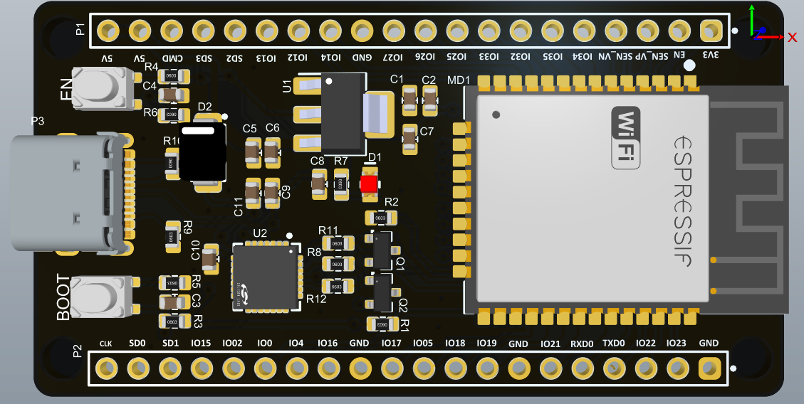

# ESP32 DevKit Type C
This project features a custom ESP32 development board with a USB Type-C connector.  
It is designed to be compact, breadboard-friendly, and optimized for SMT assembly with JLCPCB.
# Features
- ESP32-WROOM Module with WiFi + Bluetooth
- USB Type C 
- fits on standard board 
- Auto bootloader

Below is the 3D image of the circuit

# Assembly 

Assuming you are using JLCPCB SMT assembly you will need to populate just the following parts by hand:

| Reference | Description              | LCSC Part    |
|-----------|--------------------------|----------|
| P3        | USB Type C connector     | [C167321](https://www.lcsc.com/product-detail/C167321.html) |
| EN, BOOT  | RESET/BOOT push button   | [C115357](https://www.lcsc.com/product-detail/C115357.html) |
| P1, P2    | Pin headers              | [C2337](https://www.lcsc.com/product-detail/C2337.html) |
